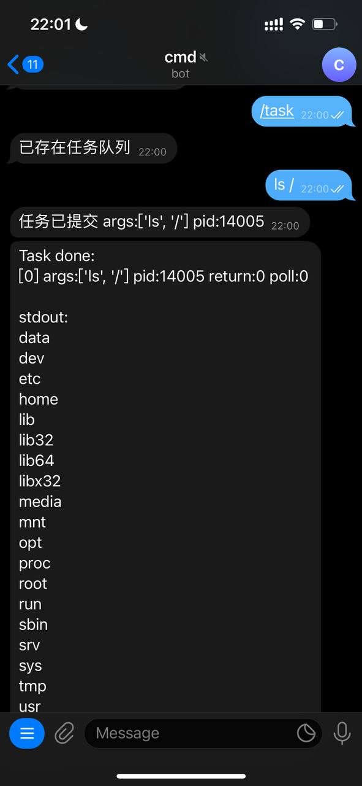
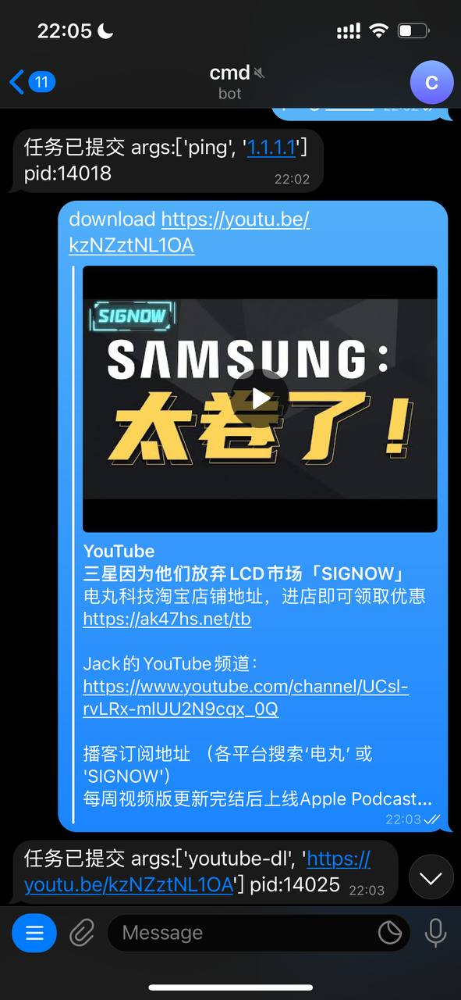
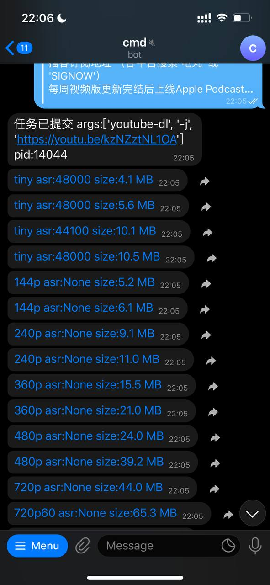
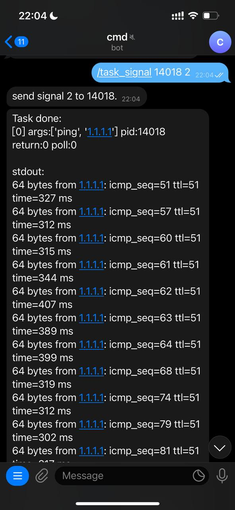

# Telegram cmd bot

测试：

[@public_cmd_bot](https://t.me/public_cmd_bot) 

[web](https://tg-cmd-bot.us.aldryn.io/)

Youtube 下载专用bot：
[@ffuck_youtube_bot](https://t.me/ffuck_youtube_bot)

```
start - Start
help - Help
task - Task pool
task_list - List all task
task_signal - Signal to task /task_signal pid sig
task_kill - Kill task /task_kill pid
bash - Start new session
bash_quiet - Slient
bash_verbose - verbose
bash_polling - polling log(only in quiet mode)
bash_sigint - Send sigint
bash_stop - Stop sessions
```

```python3
# Python versions 3.7+

python3 -m venv appenv
source appenv/bin/activate 

pip3 install psutil pyTelegramBotAPI
pip3 install python-telegram-bot --pre

python3 ./main.py
```

Youtube 相关操作依赖：[youtube-dl](http://ytdl-org.github.io/youtube-dl/download.html)





